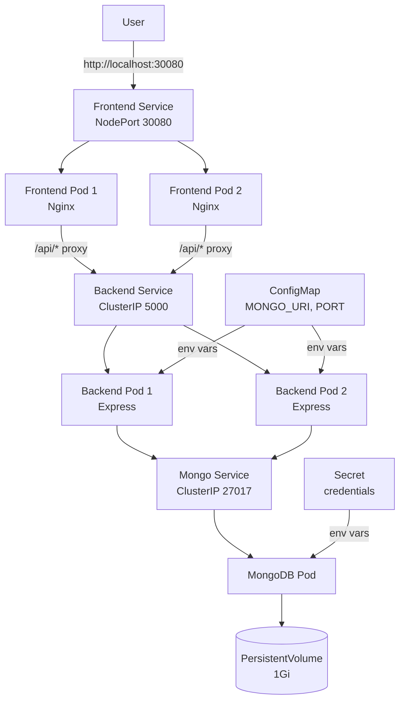

# ☸️ Kubernetes To-Do App — Phase-by-Phase Walkthrough

A comprehensive explanation of every phase: what we built, why, and how it maps to real-world Kubernetes systems.

---

## Phase 0: Repository Setup & Folder Structure

### What we did
Created a monorepo with 4 directories:
```
backend/    → Node.js Express API
frontend/   → Static HTML/JS served by Nginx
k8s/        → Kubernetes YAML manifests
docker/     → Dockerfiles for each service
```
Added `.gitignore` and `README.md` with architecture diagram.

### Why (Kubernetes concepts)
**Microservices Architecture** — Each service (`backend`, `frontend`) is an independent unit. In Kubernetes, each becomes a separate **Deployment** with its own **Pods**. This means:
- **Independent deployment** — Update the frontend without touching the backend
- **Independent scaling** — Run 5 backend replicas and 2 frontend replicas
- **Fault isolation** — If the backend crashes, the frontend still serves the UI (showing "API Unreachable")

### Real-world connection
At companies like Netflix or Uber, this is taken further — each microservice has its own repository, CI/CD pipeline, and team. We use a monorepo for simplicity, but the architecture is identical.

---

## Phase 1: Backend API (Node.js + Express + MongoDB)

### What we built
A REST API with 4 endpoints:

| Endpoint | Method | Purpose |
|----------|--------|---------|
| `/health` | GET | K8s liveness/readiness probe |
| `/tasks` | GET | List all tasks |
| `/tasks` | POST | Create a task |
| `/tasks/:id` | DELETE | Delete a task |

Files: `server.js`, `models/Task.js`, `package.json`

### Why (Kubernetes concepts)

**1. Stateless Design**
The backend stores NOTHING in memory — every request reads/writes MongoDB directly. Why?

When K8s scales to 3 replicas, each is a separate Pod with its own memory. If Pod 1 stored session data, Pod 2 wouldn't have it. Requests are load-balanced randomly, so any Pod must be able to handle any request. Stateless = scalable.

```
Request A → [Load Balancer] → Pod 1  ──→ MongoDB
Request B → [Load Balancer] → Pod 2  ──→ MongoDB  (same data!)
Request C → [Load Balancer] → Pod 3  ──→ MongoDB  (same data!)
```

**2. Externalized Configuration**
`MONGO_URI` comes from `process.env.MONGO_URI`, NOT hardcoded. In K8s, this is injected via a **ConfigMap**. The same Docker image works in:
- Development: `mongodb://localhost:27017/tododb`
- Kubernetes: `mongodb://mongo-service:27017/tododb`
- Production: `mongodb+srv://atlas-cluster.mongodb.net/tododb`

No code changes needed — just swap the ConfigMap.

**3. Health Endpoint**
K8s constantly checks if Pods are alive. It pings `/health`:
- **Liveness probe**: "Is this Pod alive?" → If not, K8s kills & restarts it.
- **Readiness probe**: "Is this Pod ready for traffic?" → If not, K8s removes it from the Service load balancer until it recovers.

### Real-world connection
This is the "12-Factor App" methodology — used universally in cloud-native development. Netflix, Stripe, Shopify all follow this: stateless services, externalized config, health checks.

---

## Phase 2: Frontend (HTML/JS/CSS + Nginx)

### What we built
A minimal but polished To-Do UI with:
- Dark mode design with CSS custom properties
- Fetch-based API calls to `/api` endpoint
- XSS prevention via DOM-based HTML escaping
- API connectivity status indicator

Key innovation: **Nginx reverse proxy**

The `nginx.conf` serves static files AND proxies `/api/*` requests to the backend:
```
Browser request: GET /api/tasks
    → Nginx (frontend Pod): matches location /api/
    → proxy_pass http://backend-service:5000/tasks
    → Backend Pod processes the request
    → Response flows back through Nginx to the browser
```

### Why (Kubernetes concepts)

**Service-to-Service Communication**
In K8s, the frontend and backend are separate Pods with separate IPs. The browser can't call `backend-service:5000` directly — that's a cluster-internal DNS name. So Nginx acts as a bridge:

1. The browser only talks to Nginx (port 80 on the frontend Pod)
2. Nginx forwards `/api/*` requests to `backend-service:5000`
3. `backend-service` is a **K8s Service name** — resolved by K8s DNS automatically
4. The browser never needs to know the backend Pod's IP

**Why separate services?**
- **Independent scaling**: API-heavy? Scale backend to 10 replicas. Frontend stays at 2.
- **Independent deployment**: Redesign the UI → redeploy only the frontend. Zero backend downtime.
- **Technology freedom**: Today it's HTML/JS. Tomorrow you could swap to React, Vue, or even a mobile app — the backend API stays the same.

### Real-world connection
This is the **Backend-for-Frontend (BFF)** pattern. Companies use Nginx, Kong, or Envoy as API gateways to route traffic between services. In production, the frontend might be a CDN (CloudFront, Cloudflare) while the API runs in the K8s cluster.

---

## Phase 3: Dockerization

### What we built

| File | Base Image | Size | Purpose |
|------|-----------|------|---------|
| `docker/backend.Dockerfile` | `node:20-alpine` | ~120MB | Package Express API |
| `docker/frontend.Dockerfile` | `nginx:alpine` | ~25MB | Package static files + proxy config |

Backend Dockerfile uses **layer caching**: `COPY package*.json` + `npm ci` happens before `COPY . .`, so rebuilds are fast when only source code changes.

### Why (Kubernetes concepts)

**Containers → Pods**
Kubernetes doesn't run raw code — it runs **containers**. A container = app + runtime + dependencies, all bundled into a portable image.

```
Code  +  Runtime  +  Dependencies  =  Container Image
                                            │
                                     wrapped in a Pod
                                            │
                                   managed by a Deployment
```

A **Pod** is the smallest K8s unit. It wraps one or more containers and adds:
- **Its own IP address** (every Pod gets one)
- **Shared storage** (containers in the same Pod can share files)
- **Lifecycle management** (K8s restarts it if it crashes)

Usually it's **1 container = 1 Pod**. Sidecar patterns (like log collectors) are the exception.

**Why Alpine images?**
Alpine Linux is ~5MB vs ~100MB for full Linux. Smaller images = faster pulls, less disk, smaller attack surface. This matters in K8s where nodes may pull images frequently during scaling events.

### Real-world connection
Every company using Kubernetes uses Docker (or a compatible runtime like containerd). The build pipeline is: Code → Docker Build → Push to Registry (ECR, GCR, Docker Hub) → K8s pulls and runs it.

---

## Phase 4: Kubernetes Deployments

### What we created

| Deployment | Replicas | Image | Key Features |
|-----------|----------|-------|--------------|
| `mongo-deployment` | 1 | `mongo:7` | PVC mount, Secret injection, resource limits |
| `backend-deployment` | 2 | `todo-backend:latest` | ConfigMap injection, health probes, rolling updates |
| `frontend-deployment` | 2 | `todo-frontend:latest` | Health probes, rolling updates, resource limits |

### Why (Kubernetes concepts)

**What is a Pod?**
The smallest deployable unit. Wraps containers. Gets its own IP. Ephemeral — can be killed and replaced at any time.

**What is a Deployment?**
A controller that manages Pods declaratively. You say "I want 2 replicas of this container," and the Deployment controller:
1. Creates 2 Pods
2. Monitors them continuously
3. If one crashes → creates a new one automatically
4. If you change the image → performs a rolling update

**Why replicas matter (scaling)**
```
replicas: 1  →  Single point of failure. Pod dies = app dies.
replicas: 2  →  If one Pod dies, the other serves traffic while K8s recovers.
replicas: 5  →  Handle 5x the load + survive multiple failures.
```

MongoDB has 1 replica because databases are **stateful** — running multiple MongoDB instances requires its own replication protocol. Backend/Frontend have 2 replicas because they're **stateless** — any replica can handle any request.

**Resource requests/limits**
```yaml
resources:
  requests:    # "I need at least this much" — used for scheduling
    memory: "128Mi"
    cpu: "100m"
  limits:      # "Don't use more than this" — enforced at runtime
    memory: "256Mi"
    cpu: "250m"
```
Without limits, a runaway container could eat all node resources and crash everything.

### Real-world connection
Every production K8s cluster uses Deployments. Netflix runs tens of thousands of Pods across their clusters. The Deployment controller is the workhorse of Kubernetes.

---

## Phase 5: Kubernetes Services

### What we created

| Service | Type | Port | Access |
|---------|------|------|--------|
| `mongo-service` | ClusterIP | 27017 | Internal only |
| `backend-service` | ClusterIP | 5000 | Internal only |
| `frontend-service` | NodePort | 80→30080 | External access |

### Why (Kubernetes concepts)

**The Problem Services Solve**
Pods are ephemeral — they get **new IP addresses** every time they restart. If the backend hardcoded `mongodb://10.244.1.5:27017`, it would break the moment the MongoDB Pod restarts.

**Services provide a stable DNS name and IP.** The backend connects to `mongo-service:27017`. K8s DNS resolves this to the current Pod IP automatically, no matter how many times it restarts.

**Service Types:**

| Type | Access | Use Case |
|------|--------|----------|
| **ClusterIP** | Internal only | Backend ↔ MongoDB, Frontend ↔ Backend |
| **NodePort** | External (port 30000-32767) | Dev/testing access to frontend |
| **LoadBalancer** | External (cloud LB with public IP) | Production on AWS/GCP/Azure |
| **Ingress** | External (HTTP routing by URL/host) | Production API gateway |

**How selectors work:**
```yaml
selector:
  app: todo-app
  tier: backend
```
The Service finds all Pods with labels `app=todo-app` AND `tier=backend` and load-balances traffic across them. Scale to 10 Pods? The Service automatically includes all of them.

### Real-world connection
Services are Kubernetes' built-in service discovery mechanism. They replace what tools like Consul or Eureka do in traditional microservices. In production, you'd use a LoadBalancer or Ingress in front of the frontend, not NodePort.

---

## Phase 6: ConfigMap & Secrets

### What we created

| Resource | Purpose | Data |
|----------|---------|------|
| `todo-config` (ConfigMap) | Non-sensitive config | `MONGO_URI`, `PORT` |
| `mongo-secret` (Secret) | Sensitive credentials | MongoDB username/password (base64) |

### Why (Kubernetes concepts)

**Why not hardcode config?**
Hardcoding `mongodb://mongo-service:27017` means:
- Different code per environment
- Rebuilding images for config changes
- Secrets committed to Git (security risk)

With ConfigMaps, the SAME image works everywhere. You just swap configs:
- Dev ConfigMap: `MONGO_URI=mongodb://localhost:27017/tododb`
- K8s ConfigMap: `MONGO_URI=mongodb://mongo-service:27017/tododb`
- Prod ConfigMap: `MONGO_URI=mongodb+srv://atlas/tododb`

**ConfigMap vs Secret:**

| Feature | ConfigMap | Secret |
|---------|-----------|--------|
| Data type | Non-sensitive | Sensitive |
| Storage | Plain text in etcd | Base64 in etcd (can be encrypted at rest) |
| RBAC | Broader access | Restricted access |
| Examples | URLs, ports, feature flags | Passwords, API keys, TLS certs |

**How injection works:**
```yaml
envFrom:
  - configMapRef:
      name: todo-config   # All keys become env vars
```
The container sees `process.env.MONGO_URI` just like a `.env` file, but managed by K8s.

### Real-world connection
In production, Secrets are typically managed by external tools like **HashiCorp Vault**, **AWS Secrets Manager**, or **Sealed Secrets** (encrypted in Git, decrypted in cluster). Never commit real credentials to Git — even base64 is not encryption.

---

## Phase 7: Persistent Storage

### What we created

| Resource | Purpose |
|----------|---------|
| `mongo-pv` (PersistentVolume) | 1Gi hostPath storage at `/mnt/data/mongo` |
| `mongo-pvc` (PersistentVolumeClaim) | Pod's request for 1Gi of storage |

### Why (Kubernetes concepts)

**The Ephemeral Container Problem**
Containers are ephemeral by design. When a Pod restarts:
```
❌ All files inside the container = DELETED
❌ Database data = GONE
❌ User uploads = LOST
```

For a database, this is catastrophic. You'd lose all tasks every restart.

**PersistentVolumes solve this:**
```
Pod restarts → container filesystem is fresh (empty)
           BUT→ PersistentVolume still has all the data
           → Container mounts the PV at /data/db
           → MongoDB reads existing data from the volume
           → Nothing is lost! ✅
```

**PV vs PVC analogy:**
- **PV (PersistentVolume)** = The actual hard drive. Exists independently of Pods.
- **PVC (PersistentVolumeClaim)** = A "request" by a Pod: "I need 1Gi of storage."
- K8s matches PVCs to available PVs automatically (like a hotel reservation system).

**storageClassName: manual** — We use `hostPath` (a folder on the node) for local development. In production:
- AWS: `gp3` EBS volumes
- GCP: `pd-ssd` Persistent Disks
- Azure: `managed-premium` Disks
- These are provisioned **dynamically** — you just submit a PVC and the cloud creates the disk.

### Real-world connection
In production, databases are often run as **StatefulSets** (not Deployments) with **dynamic StorageClass provisioning**. Many companies skip self-managed databases entirely and use managed services (Amazon RDS, Cloud SQL, MongoDB Atlas) — the database runs outside K8s while the app runs inside.

---

## Phase 8: Testing & Verification

### How services communicate internally

```
Browser (http://localhost:30080)
    │
    ▼
frontend-service (NodePort 30080)
    │  ← K8s routes to a frontend Pod
    ▼
Frontend Pod (Nginx on port 80)
    │
    ├── GET /index.html     → serves static file
    ├── GET /styles.css     → serves static file
    ├── GET /app.js         → serves static file
    └── GET /api/tasks      → proxy_pass to backend-service:5000
                                │
                                │ ← K8s DNS resolves "backend-service"
                                ▼
                        Backend Pod (Express on port 5000)
                                │
                                │ ← K8s DNS resolves "mongo-service"
                                ▼
                        MongoDB Pod (port 27017)
                                │
                                ▼
                        PersistentVolume (data on disk)
```

Every arrow is resolved by **K8s DNS** — no hardcoded IPs anywhere.

---

## Phase 9: Advanced — Scaling & Rolling Updates

### Scaling
```bash
kubectl scale deployment backend-deployment --replicas=5
```

K8s creates 3 new Pods (from 2 → 5). The backend Service automatically load-balances across all 5. This is **horizontal scaling** — adding more instances, not bigger instances.

### Rolling Updates
When you update the Docker image:
```bash
kubectl set image deployment/backend-deployment todo-backend=todo-backend:v2
```

K8s performs a **rolling update**:
1. Creates 1 new Pod with `v2` image
2. Waits for it to pass readiness probe
3. Removes 1 old Pod with `v1` image
4. Repeats until all Pods are `v2`

At no point are ALL Pods down → **zero-downtime deployment**.

```yaml
strategy:
  type: RollingUpdate
  rollingUpdate:
    maxUnavailable: 1   # At most 1 Pod can be down during update
    maxSurge: 1          # At most 1 extra Pod during transition
```

If `v2` fails health checks, K8s stops the rollout. You can instantly rollback:
```bash
kubectl rollout undo deployment/backend-deployment
```

### Real-world connection
Every major company uses rolling updates for production deployments. More advanced strategies include:
- **Blue/Green**: Run both versions, switch traffic instantly
- **Canary**: Send 5% of traffic to the new version, gradually increase
- **A/B Testing**: Route based on user attributes

These build on the same K8s primitives we've learned.

---

## 🏗️ Architecture Summary



| K8s Concept | What It Does | Where We Used It |
|-------------|-------------|-----------------|
| **Pod** | Wraps containers, gets an IP | Every service |
| **Deployment** | Manages Pod replicas, handles crashes | mongo/backend/frontend |
| **Service** | Stable DNS name + load balancing | ClusterIP + NodePort |
| **ConfigMap** | Non-sensitive config injection | backend MONGO_URI |
| **Secret** | Sensitive config injection | MongoDB credentials |
| **PV/PVC** | Persistent disk storage | MongoDB data dir |
| **Rolling Update** | Zero-downtime deployments | backend/frontend strategy |
| **Liveness Probe** | "Is this Pod alive?" | backend /health |
| **Readiness Probe** | "Is this Pod ready for traffic?" | backend /health |
| **Resource Limits** | Prevent runaway containers | All Pods |
